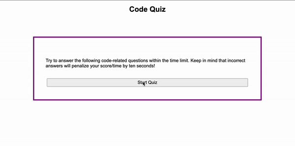

# code-quiz

This is a basic quiz application created with vanilla JavaScript. The quiz consists of various questions about JavaScript and its proper use.

## Table of Contents

- [Installation](#installation)
- [Usage](#usage)
- [Credits](#credits)
- [License](#license)

## Installation

N/A

## Usage

This page can be accessed and used on any standard web browser. After pressing a button to start the quiz, a timer starts and the user is presented with each of the questions and notfied via alerts whether they answer them correctly or incorrectly. Once the quiz is finished, the final score is the amount of time left. The user then has the option to save their score by entering their initials and have them appear on a leaderboard along with their score that is saved and pulled from local storage. This data still appears even after the browser is closed and reopened.

## Credits

Simple Step Code's article on [making a basic JavaScript quiz](https://simplestepscode.com/javascript-quiz-tutorial/) served as a great starting point for declaring my global variables. My instructor and TA for UPenn's 8-2021 LPS Coding Bootcamp were also extremley helpful in navigating bugs in my code.

## License

Creative Commons License: This work can be used by others as long as credit is given.

The application can be viewed here: [https://liaobrien.github.io/code-quiz/](https://liaobrien.github.io/code-quiz).
